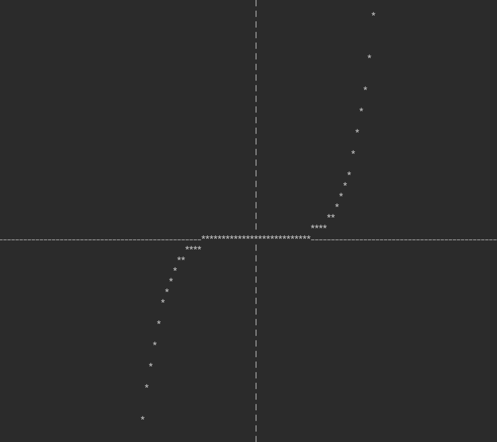
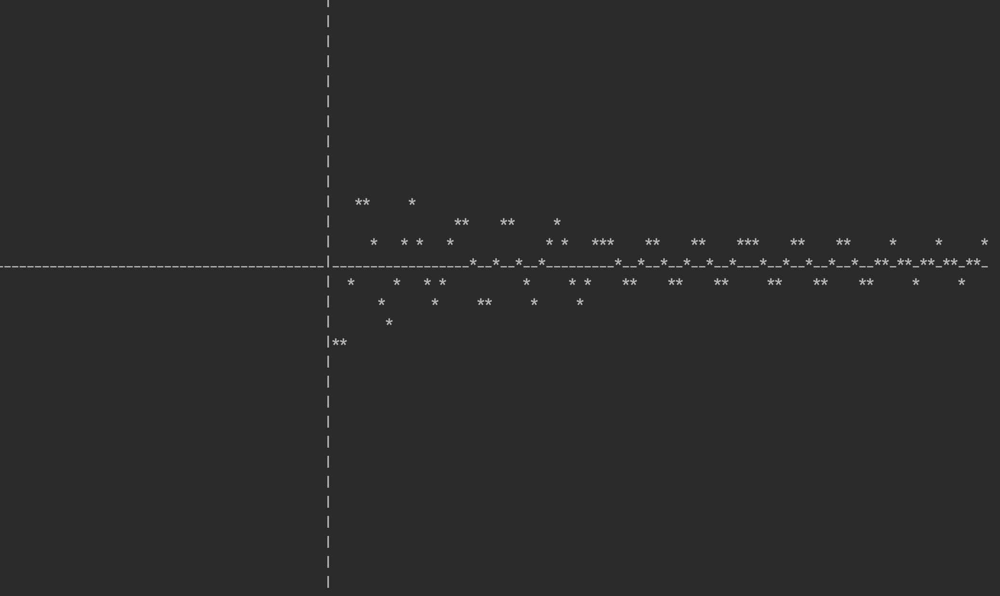
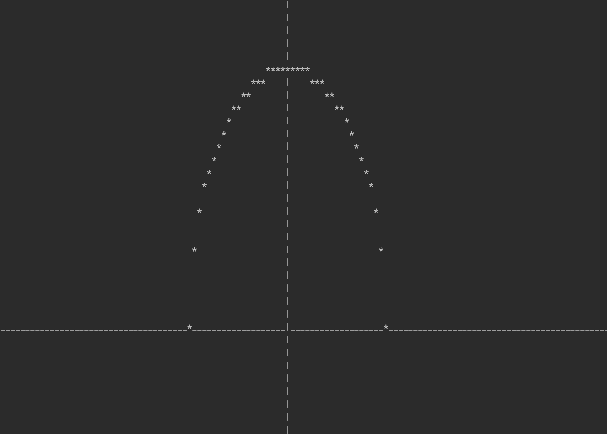
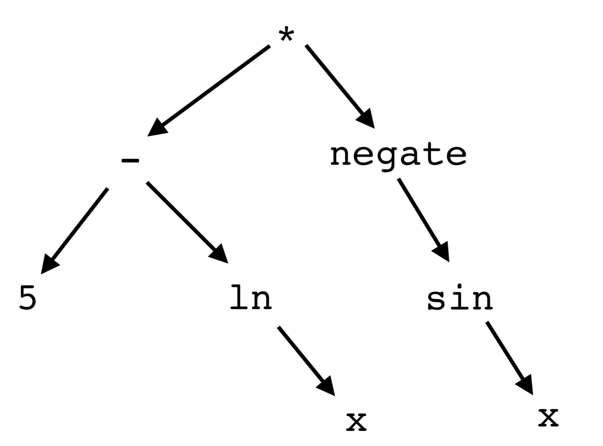

# ASCII_Graphing_Calculator
Made by Cooper Collier in June 2020

This is an interactive graphing calculator written in C. It parses raw user input through the use of a behind-the-scenes parsing tree (more on that below). This calculator can handle more than ten major math operations. It can also re-scale and move around existing graphs interactively. All of the code has many extensive comments.

### Instructions for using the calculator, as shown in the interactive display:

How to use this graphing calculator:
At any time, you can type 'q' to quit, or type 'i' to read these instructions.
You can also type in an equation to graph. This calculator supports the
following operands: +, -, \*, /, ^, sin, cos, tan, log, ln, e, pi, and any real
number. All equations should be formatted in terms of x. Note that
multiplication written like "5x" is not supported; multiplication must be
done explicitly, like "5 \* x". Also, it is recommended to use parentheses to
clarify the order of operations for your equation. Once you have graphed an
equation, you can pan n units in the x-direction by typing "x n", or pan
n units in the y-direction by typing "y n", or zoom by a factor of n by
typing "z n". For zooming, if n is less than one then the graph will zoom in.

Here are some examples of correctly formatted equations:
((sin x) \* 3) ^ 1.5

27 - ((x / -cosx) + (-2) \* (log x))

(5 - lnx) \* -sin(x)

4 \* x^ -2 - 2 \* tanx / ln x ^3

((((8 - ln x)) \* e)) + 0.85

A final note: Since ASCII text is taller than it is wide, the graph output
may appear stretched vertically.

  
    
      
      

### Here are some graphs generated by the calculator:

X^5 / (10^6)

(5 - lnx) \* -sin(x)

((20^2) - x^2) ^ 0.5

### How it works--Behind the scenes:
1) The calculator requests raw user input text, in the form of an equation. The text is then cleaned (all letters
turned to lowercase and whitespace stripped).
2) A math parser recursively parses the equation. It finds a major operand in the equation (according to the Order 
Of Operations), splits the equation in half around that operand, and repeats parsing the left and right halves recursively.
Each parsed equation is added to an instruction tree. For example, (5 - lnx) * -sin(x) is turned into this tree:

  
3) Along the way, the parser checks for any unusual behavior, and if it is detected, stops and displays an error message, prompting the user to try again. This is raised when the user inputs an incorrectly formatted equation (or if the user imputs gobbeldygook). 
4) For every x-value in the usable range, the calculator runs it through the instruction tree, and prints a dot at the (x, y) coordinate corresponsing to the result.
5) After the finished graph is printed out, the user can zoom in, zoom out, move the graph to the left, or move the graph to the right. They can keep doing this for as long as they want, until they are ready to draw a new graph.
